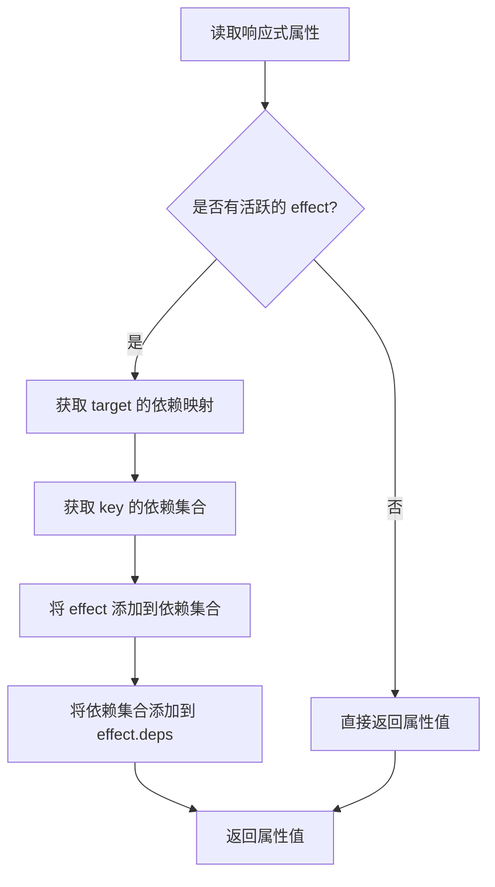
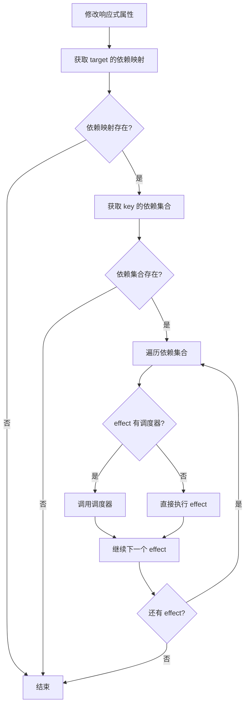

# Mini Vue 核心算法详解

## 🧮 概述

本文档详细解释 Mini Vue 中的核心算法，包括响应式系统的依赖收集与触发、虚拟 DOM 的 diff 算法、组件更新调度等。

## 🔄 响应式系统算法

### 依赖收集算法

依赖收集是响应式系统的核心，它建立了数据与副作用函数之间的关系。

#### 数据结构设计

```typescript
// 全局依赖映射表
// WeakMap<target, Map<key, Set<ReactiveEffect>>>
const targetMap = new WeakMap()

// 当前活跃的 effect
let activeEffect: ReactiveEffect | undefined

// effect 执行栈（处理嵌套 effect）
const effectStack: ReactiveEffect[] = []
```

#### 算法流程



#### 实现细节

```typescript
function track(target: object, key: unknown) {
  // 1. 检查是否有活跃的 effect
  if (!activeEffect) {
    return
  }

  // 2. 获取或创建 target 的依赖映射
  let depsMap = targetMap.get(target)
  if (!depsMap) {
    targetMap.set(target, (depsMap = new Map()))
  }

  // 3. 获取或创建 key 的依赖集合
  let dep = depsMap.get(key)
  if (!dep) {
    depsMap.set(key, (dep = new Set()))
  }

  // 4. 建立双向依赖关系
  if (!dep.has(activeEffect)) {
    dep.add(activeEffect)           // effect -> dep
    activeEffect.deps.push(dep)     // dep -> effect
  }
}
```

**时间复杂度**：O(1) - 所有操作都是常数时间
**空间复杂度**：O(n) - n 为响应式对象的属性数量

### 触发更新算法

当响应式数据发生变化时，需要触发相关的副作用函数重新执行。

#### 算法流程



#### 实现细节

```typescript
function trigger(target: object, key: unknown) {
  // 1. 获取依赖映射
  const depsMap = targetMap.get(target)
  if (!depsMap) {
    return
  }

  // 2. 获取依赖集合
  const dep = depsMap.get(key)
  if (!dep) {
    return
  }

  // 3. 创建新的 Set 避免在遍历过程中修改原 Set
  const effects = new Set(dep)

  // 4. 执行所有相关的 effect
  effects.forEach(effect => {
    // 避免无限递归
    if (effect !== activeEffect) {
      if (effect.scheduler) {
        effect.scheduler(effect)
      } else {
        effect.run()
      }
    }
  })
}
```

**时间复杂度**：O(m) - m 为依赖该属性的 effect 数量
**空间复杂度**：O(m) - 创建新 Set 的空间开销

### 计算属性缓存算法

计算属性通过脏检查机制实现缓存，只在依赖发生变化时重新计算。

#### 算法原理

```typescript
class ComputedRefImpl {
  private _value: T
  private _dirty = true  // 脏检查标记
  private _effect: ReactiveEffect<T>

  constructor(getter: () => T) {
    this._effect = new ReactiveEffect(getter, {
      lazy: true,  // 懒执行
      scheduler: () => {
        // 依赖变化时标记为脏
        if (!this._dirty) {
          this._dirty = true
          trigger(this, 'value')  // 触发计算属性的更新
        }
      }
    })
  }

  get value() {
    track(this, 'value')  // 收集对计算属性的依赖
    
    if (this._dirty) {
      this._value = this._effect.run()!
      this._dirty = false
    }
    
    return this._value
  }
}
```

**优化效果**：
- 避免重复计算：只在依赖变化时重新计算
- 支持链式依赖：计算属性可以依赖其他计算属性
- 内存效率：不会无限制地缓存历史值

## 🌳 虚拟 DOM Diff 算法

### 简化版 Diff 算法

Mini Vue 实现了一个简化版的 diff 算法，主要处理以下场景：

#### 1. 文本节点比较

```typescript
function processText(n1: VNode | null, n2: VNode, container: Element) {
  if (n1 == null) {
    // 挂载新文本节点
    n2.el = createText(n2.children as string)
    insert(n2.el, container)
  } else {
    // 更新文本内容
    const el = (n2.el = n1.el!)
    if (n2.children !== n1.children) {
      setText(el as Text, n2.children as string)
    }
  }
}
```

#### 2. 元素节点比较

```typescript
function patchElement(n1: VNode, n2: VNode) {
  const el = (n2.el = n1.el!)
  
  // 更新属性
  const oldProps = n1.props || {}
  const newProps = n2.props || {}
  patchProps(el, oldProps, newProps)
  
  // 更新子节点
  patchChildren(n1, n2, el)
}
```

#### 3. 子节点数组比较

这是 diff 算法的核心部分，处理子节点数组的变化：

```typescript
function patchKeyedChildren(
  c1: VNode[],  // 旧子节点
  c2: VNode[],  // 新子节点
  container: Element
) {
  let i = 0
  const l2 = c2.length
  let e1 = c1.length - 1  // 旧子节点的结束索引
  let e2 = l2 - 1         // 新子节点的结束索引

  // 1. 从头开始比较相同的节点
  while (i <= e1 && i <= e2) {
    const n1 = c1[i]
    const n2 = c2[i]
    if (isSameVNodeType(n1, n2)) {
      patch(n1, n2, container)
    } else {
      break
    }
    i++
  }

  // 2. 从尾开始比较相同的节点
  while (i <= e1 && i <= e2) {
    const n1 = c1[e1]
    const n2 = c2[e2]
    if (isSameVNodeType(n1, n2)) {
      patch(n1, n2, container)
    } else {
      break
    }
    e1--
    e2--
  }

  // 3. 新节点比旧节点多 - 挂载新节点
  if (i > e1) {
    if (i <= e2) {
      const nextPos = e2 + 1
      const anchor = nextPos < l2 ? c2[nextPos].el : null
      while (i <= e2) {
        patch(null, c2[i], container, anchor)
        i++
      }
    }
  }
  // 4. 旧节点比新节点多 - 卸载旧节点
  else if (i > e2) {
    while (i <= e1) {
      unmount(c1[i])
      i++
    }
  }
  // 5. 中间部分的复杂情况（简化处理）
  else {
    // 简化处理：直接卸载旧节点，挂载新节点
    for (let j = i; j <= e1; j++) {
      unmount(c1[j])
    }
    for (let j = i; j <= e2; j++) {
      patch(null, c2[j], container)
    }
  }
}
```

### Diff 算法复杂度分析

**最佳情况**：O(n) - 节点顺序没有变化，只需要一次遍历
**最坏情况**：O(n²) - 在复杂的节点移动场景下
**平均情况**：O(n) - 大多数实际场景下的性能

### 优化策略

1. **预处理优化**：先处理头尾相同的节点
2. **类型判断优化**：使用 ShapeFlags 进行快速类型判断
3. **key 优化**：通过 key 快速判断节点是否相同

## ⚡ 更新调度算法

### 异步更新队列

为了避免同步更新导致的性能问题，Mini Vue 实现了异步更新队列：

```typescript
const queue: Function[] = []
let isFlushPending = false

function queueJob(job: Function) {
  if (!queue.includes(job)) {
    queue.push(job)
  }
  queueFlush()
}

function queueFlush() {
  if (!isFlushPending) {
    isFlushPending = true
    Promise.resolve().then(flushJobs)
  }
}

function flushJobs() {
  isFlushPending = false
  queue.forEach(job => job())
  queue.length = 0
}
```

### 调度策略

1. **去重**：相同的更新任务只会被添加一次
2. **批量执行**：在下一个微任务中批量执行所有更新
3. **优先级**：可以通过调度器实现不同优先级的更新

## 🎯 算法性能总结

| 算法 | 时间复杂度 | 空间复杂度 | 优化策略 |
|------|------------|------------|----------|
| 依赖收集 | O(1) | O(n) | WeakMap + Set |
| 触发更新 | O(m) | O(m) | 避免重复执行 |
| 计算属性 | O(1) | O(1) | 脏检查缓存 |
| Diff 算法 | O(n) | O(1) | 预处理 + key 优化 |
| 更新调度 | O(n) | O(n) | 异步批量更新 |

这些算法的设计都遵循了现代前端框架的最佳实践，在保证功能正确性的同时，尽可能地优化性能。
