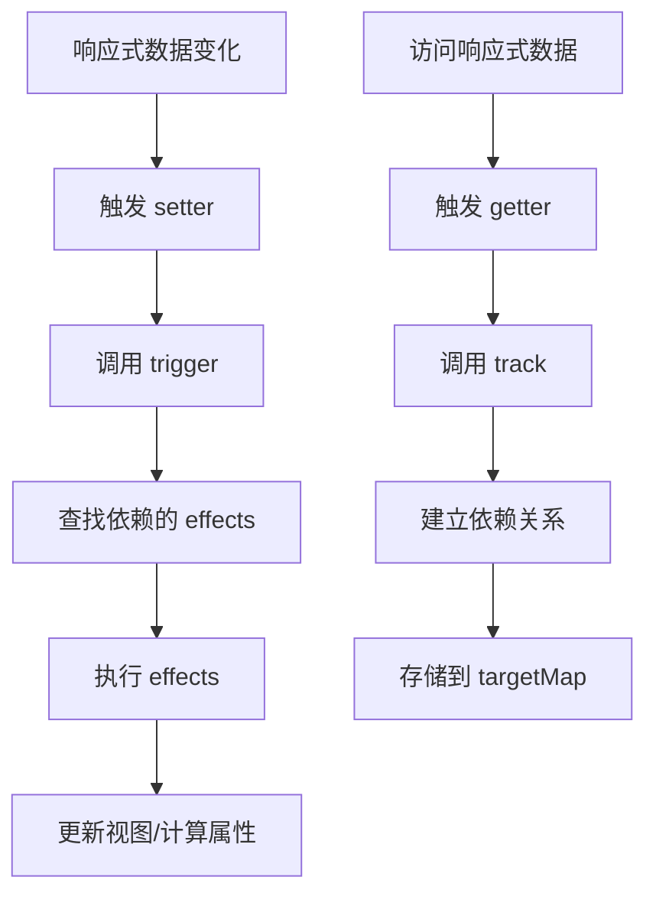

# 响应式系统详解

## 📖 概述

响应式系统是 Vue 3 的核心特性，它能够自动追踪数据的变化并更新相关的视图。本文档详细解析 Mini Vue 中响应式系统的实现原理。

## 🎯 核心概念

### 1. 响应式数据
- **reactive**: 将对象转换为响应式对象
- **ref**: 将基本类型值转换为响应式引用
- **computed**: 基于其他响应式数据计算得出的值

### 2. 副作用函数
- **effect**: 当响应式数据变化时自动执行的函数
- **依赖收集**: 记录哪些数据被哪些 effect 使用
- **触发更新**: 数据变化时执行相关的 effect

## 🏗️ 架构设计

```
响应式系统架构
├── Effect 系统
│   ├── ReactiveEffect 类
│   ├── 依赖收集 (track)
│   └── 触发更新 (trigger)
├── Reactive 系统
│   ├── reactive() 函数
│   ├── Proxy 拦截器
│   └── 嵌套对象处理
├── Ref 系统
│   ├── RefImpl 类
│   ├── 基本类型包装
│   └── 自动解包
└── Computed 系统
    ├── ComputedRefImpl 类
    ├── 懒计算
    └── 缓存机制
```

## 🔧 Effect 系统实现

### ReactiveEffect 类

```typescript
export class ReactiveEffect<T = any> {
  private _fn: () => T
  public deps: Set<ReactiveEffect>[] = []
  public active = true
  public scheduler?: (job: ReactiveEffect) => void

  constructor(fn: () => T, options?: ReactiveEffectOptions) {
    this._fn = fn
    if (options) {
      this.scheduler = options.scheduler
    }
  }

  run() {
    // 如果 effect 已停止，直接执行函数
    if (!this.active) {
      return this._fn()
    }

    try {
      // 设置当前活跃的 effect
      effectStack.push(this)
      activeEffect = this
      
      // 清理旧的依赖关系
      cleanupEffect(this)
      
      // 执行函数，触发依赖收集
      return this._fn()
    } finally {
      // 恢复之前的 effect
      effectStack.pop()
      activeEffect = effectStack[effectStack.length - 1]
    }
  }

  stop() {
    if (this.active) {
      cleanupEffect(this)
      this.active = false
    }
  }
}
```

**设计要点：**
1. **effect 栈**: 处理嵌套 effect 的情况
2. **依赖清理**: 每次执行前清理旧依赖，避免内存泄漏
3. **调度器**: 支持自定义更新时机

### 依赖收集机制

```typescript
// 全局变量
let activeEffect: ReactiveEffect | undefined
const targetMap = new WeakMap<object, Map<any, Set<ReactiveEffect>>>()

export function track(target: object, key: unknown) {
  // 没有活跃的 effect，不需要收集依赖
  if (!activeEffect) return

  // 获取目标对象的依赖映射
  let depsMap = targetMap.get(target)
  if (!depsMap) {
    targetMap.set(target, (depsMap = new Map()))
  }

  // 获取属性的依赖集合
  let dep = depsMap.get(key)
  if (!dep) {
    depsMap.set(key, (dep = new Set()))
  }

  // 建立双向依赖关系
  if (!dep.has(activeEffect)) {
    dep.add(activeEffect)
    activeEffect.deps.push(dep)
  }
}
```

**数据结构说明：**
```
targetMap: WeakMap {
  target1: Map {
    key1: Set [effect1, effect2],
    key2: Set [effect1]
  },
  target2: Map {
    key1: Set [effect2]
  }
}
```

### 触发更新机制

```typescript
export function trigger(target: object, key: unknown) {
  const depsMap = targetMap.get(target)
  if (!depsMap) return

  const dep = depsMap.get(key)
  if (!dep) return

  // 创建新的 Set 避免在遍历过程中修改原 Set
  const effects = new Set(dep)

  effects.forEach((effect) => {
    // 避免无限递归：如果当前正在执行的 effect 就是要触发的 effect，跳过
    if (effect !== activeEffect) {
      if (effect.scheduler) {
        // 使用调度器
        effect.scheduler(effect)
      } else {
        // 直接执行
        effect.run()
      }
    }
  })
}
```

## 🎯 Reactive 系统实现

### 核心实现

```typescript
const reactiveMap = new WeakMap<object, any>()

export function reactive<T extends object>(target: T): T {
  // 类型检查
  if (!isObject(target)) {
    console.warn(`reactive() can only be called on objects`)
    return target
  }

  // 避免重复代理
  if (isReactive(target)) {
    return target
  }

  // 返回缓存的代理对象
  const existingProxy = reactiveMap.get(target)
  if (existingProxy) {
    return existingProxy
  }

  // 创建 Proxy 代理
  const proxy = new Proxy(target, {
    get(target, key, receiver) {
      // 处理响应式标识
      if (key === ReactiveFlags.IS_REACTIVE) {
        return true
      }

      const result = Reflect.get(target, key, receiver)
      
      // 依赖收集
      track(target, key)

      // 递归处理嵌套对象
      if (isObject(result)) {
        return reactive(result)
      }

      return result
    },

    set(target, key, value, receiver) {
      const oldValue = (target as any)[key]
      const result = Reflect.set(target, key, value, receiver)

      // 值发生变化时触发更新
      if (oldValue !== value) {
        trigger(target, key)
      }

      return result
    },

    has(target, key) {
      const result = Reflect.has(target, key)
      track(target, key)
      return result
    },

    ownKeys(target) {
      track(target, Symbol('ownKeys'))
      return Reflect.ownKeys(target)
    },

    deleteProperty(target, key) {
      const hadKey = Object.prototype.hasOwnProperty.call(target, key)
      const result = Reflect.deleteProperty(target, key)

      if (result && hadKey) {
        trigger(target, key)
      }

      return result
    }
  })

  // 缓存代理对象
  reactiveMap.set(target, proxy)
  return proxy
}
```

**关键特性：**
1. **深度响应**: 自动处理嵌套对象
2. **缓存机制**: 避免重复创建代理
3. **完整拦截**: 拦截所有对象操作
4. **性能优化**: 使用 WeakMap 避免内存泄漏

## 📦 Ref 系统实现

### RefImpl 类

```typescript
class RefImpl<T> {
  private _value: T
  public readonly __v_isRef = true

  constructor(value: T) {
    // 如果值是对象，转换为响应式对象
    this._value = convert(value)
  }

  get value() {
    // 依赖收集
    track(this, 'value')
    return this._value
  }

  set value(newValue: T) {
    // 值没有变化时不触发更新
    if (newValue === this._value) return
    
    this._value = convert(newValue)
    // 触发更新
    trigger(this, 'value')
  }
}

function convert<T>(value: T): T {
  return isObject(value) ? reactive(value as any) : value
}
```

### 工具函数

```typescript
// 判断是否为 ref
export function isRef<T>(value: Ref<T> | unknown): value is Ref<T> {
  return !!(value && (value as any).__v_isRef)
}

// 获取 ref 的值
export function unref<T>(ref: T | Ref<T>): T {
  return isRef(ref) ? ref.value : ref
}

// 自动解包 ref
export function proxyRefs<T extends object>(objectWithRefs: T): T {
  return new Proxy(objectWithRefs, {
    get(target, key, receiver) {
      const result = Reflect.get(target, key, receiver)
      return isRef(result) ? result.value : result
    },

    set(target, key, value, receiver) {
      const oldValue = (target as any)[key]

      if (isRef(oldValue) && !isRef(value)) {
        oldValue.value = value
        return true
      } else {
        return Reflect.set(target, key, value, receiver)
      }
    },
  })
}
```

## 💡 Computed 系统实现

### ComputedRefImpl 类

```typescript
class ComputedRefImpl<T> {
  private _value!: T
  private _dirty = true  // 脏检查标记
  private _effect: ReactiveEffect<T>
  public readonly __v_isRef = true

  constructor(getter: () => T, private readonly _setter?: (value: T) => void) {
    // 创建懒执行的 effect
    this._effect = new ReactiveEffect(getter, {
      lazy: true,
      scheduler: () => {
        // 依赖变化时标记为 dirty
        if (!this._dirty) {
          this._dirty = true
          // 触发计算属性的更新
          trigger(this, 'value')
        }
      }
    })
  }

  get value() {
    // 依赖收集
    track(this, 'value')

    // 只有在 dirty 时才重新计算
    if (this._dirty) {
      this._value = this._effect.run()!
      this._dirty = false
    }

    return this._value
  }

  set value(newValue: T) {
    if (this._setter) {
      this._setter(newValue)
    } else {
      console.warn('Computed property is readonly')
    }
  }
}
```

**计算属性特点：**
1. **懒计算**: 只有在访问时才计算值
2. **缓存机制**: 依赖不变时返回缓存值
3. **响应式**: 依赖变化时自动重新计算
4. **可写计算属性**: 支持 setter 函数

## 🔄 响应式更新流程



## 🎯 使用示例

```typescript
import { reactive, ref, computed, effect } from './reactivity'

// 1. 基础响应式
const state = reactive({ count: 0, name: 'Vue' })
const count = ref(0)

// 2. 计算属性
const doubleCount = computed(() => state.count * 2)

// 3. 副作用函数
effect(() => {
  console.log(`Count is: ${state.count}`)
})

// 4. 数据变化触发更新
state.count++ // 输出: Count is: 1
count.value++ // ref 需要通过 .value 访问
```

## 🚀 性能优化

1. **WeakMap 使用**: 避免内存泄漏
2. **依赖清理**: 防止无效依赖累积
3. **缓存机制**: 避免重复创建代理对象
4. **懒计算**: 计算属性按需计算
5. **调度器**: 支持批量更新和异步更新

## 🔍 与 Vue 3 的差异

| 特性 | Mini Vue | Vue 3 |
|------|----------|-------|
| 基础响应式 | ✅ 完整实现 | ✅ 完整实现 |
| 深度响应 | ✅ 支持 | ✅ 支持 |
| 数组响应式 | ⚠️ 基础支持 | ✅ 完整支持 |
| Map/Set 响应式 | ❌ 不支持 | ✅ 支持 |
| 性能优化 | ⚠️ 基础优化 | ✅ 高度优化 |
| 错误处理 | ⚠️ 基础处理 | ✅ 完善处理 |

## 📚 相关文档

- [实现指南](./implementation-guide.md)
- [虚拟 DOM 系统](./virtual-dom.md)
- [组件系统](./component-system.md)
